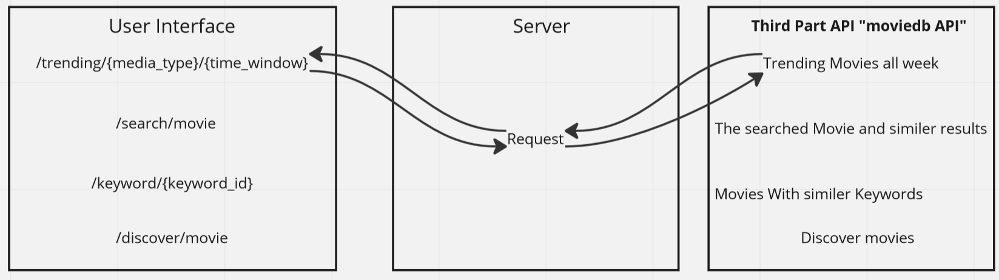

# Movies-Library
## Version 1.0.1 - 21/March/2023
- Installed cors
- Installed nodemon
- Installed axios
- Installed dotenv
-  Create GET request to the 3rd party API for these endpoints:
- trending: Get the trending movies data from the Movie DB API Link
## Version 1.0.0 - 19/March/2023
- Installed express 
- Create a route with a method of get and a path of /. The callback should use the provided JSON data.
- Create a constructor function to ensure your data follow the same format.

**Author Name**: Almothana Almasri

## WRRC

## Overview

This project is a web application that allows users to create and share their favorite movies list.

## Getting Started

To run this application on your local machine, follow these steps:

1. Clone the repository to your local machine.
2. Install the required dependencies by running npm install.
3. Start the server by running npm start.
4. Navigate to http://localhost:3000 on your web browser.

## Project Features

- Users can add movies to their favorite list.
